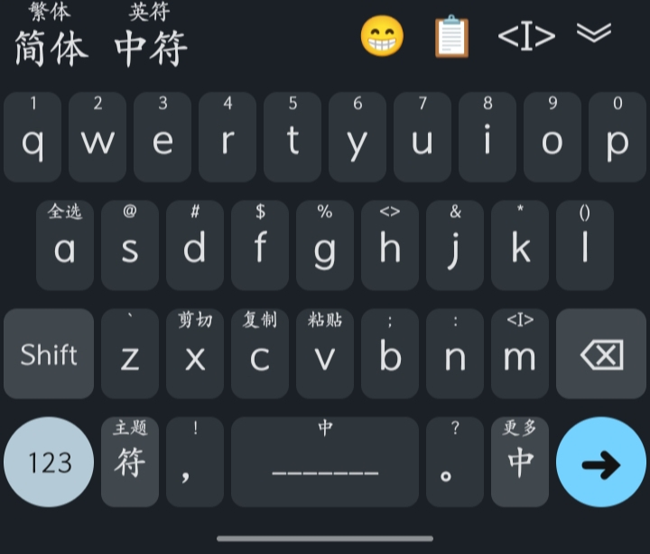
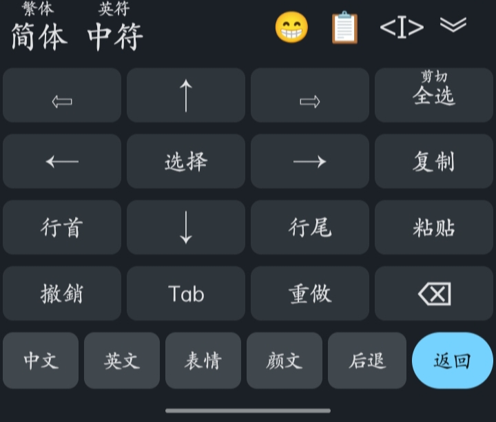
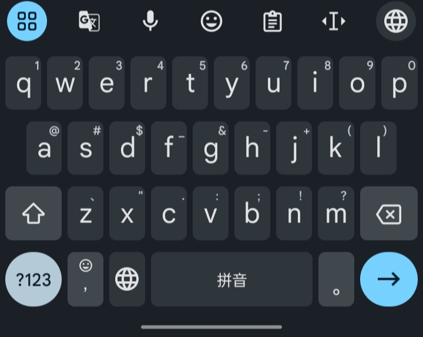

# Trime_Theme

### 最像Gboard的[同文输入法](https://github.com/osfans/trime)主题
 * 高仿Gboard主题
 * 目前只做了26键的蓝色夜间

### 效果预览




### Gboard


### 附带我的快捷栏代码
```yaml
    switches:
  - name: transcription
    states: [ 简体 , 繁体 ]
    reset: 0
  - name: ascii_punct
    states: [ 中符 , 英符 ]
    reset: 0
  - options: [_key_VoidSymbol]
    states: ["           "]
  - options: [ _key_liquid_keyboard_emoji ]
    states: [ 😁️ ]
  - options: [ _key_liquid_keyboard_clipboard ]
    states: [ 📋 ]
  - options: [ _keyboard_numberb ]
    states: [ <I> ]
  - options: [_key_Hide]
    states: ["︾"]
```
